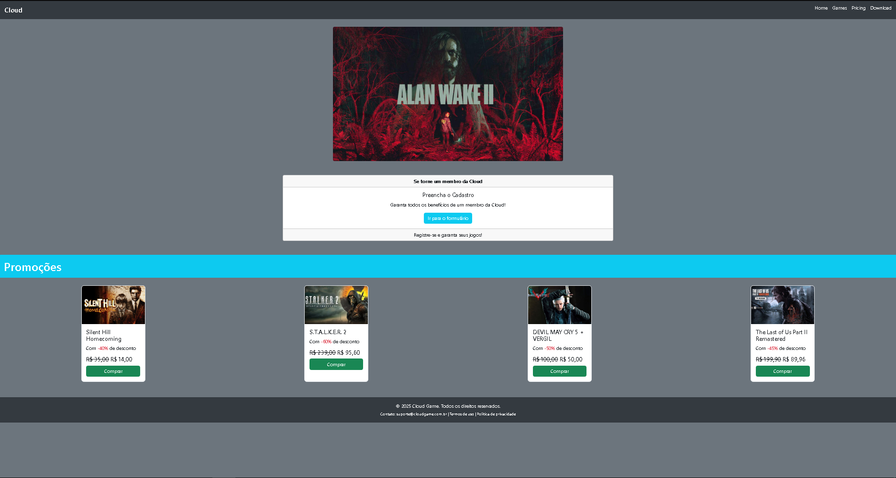
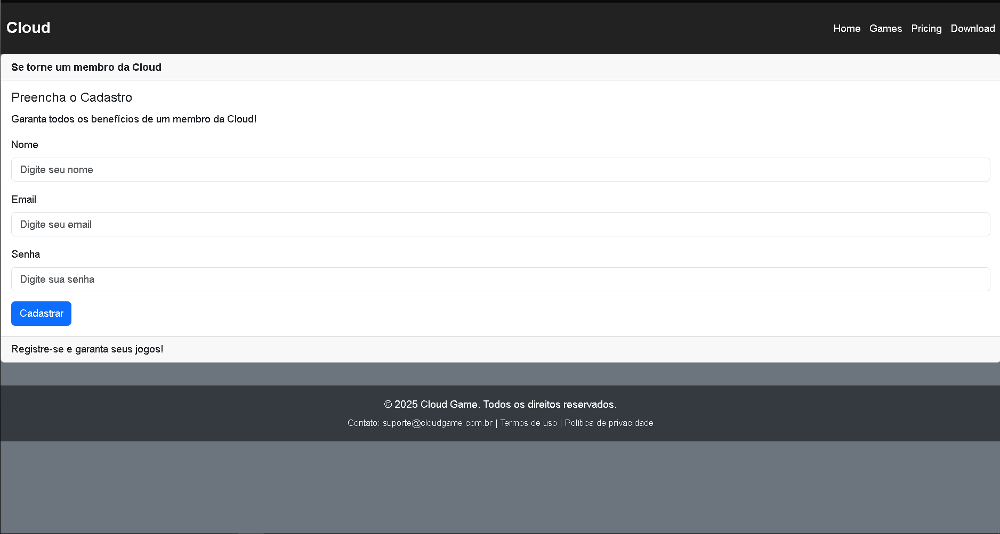
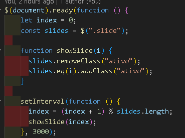
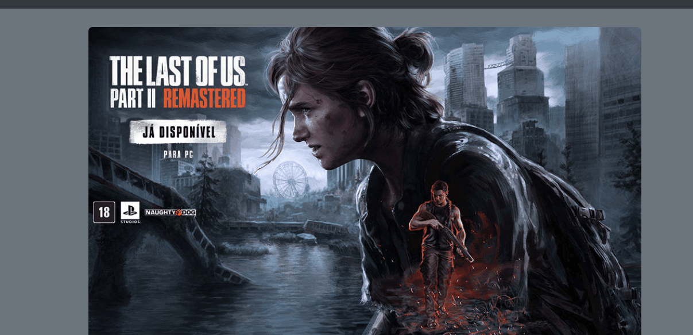

# Projeto LandPage Cloud Store
Landing Page de jogos, este projeto visa colocar em prática conhecimentos adquiridos em sala de aula na area de desenvolvimento Web focando nas tecnologias HTML5, CSS3, Javascript e a utilização de alguns Frameworks e Bibliotecas.

### Autor
[@Vitor_Oliveira](https://github.com/Non-entityy) :pensive:

### Tecnologias utilizadas: 
  

    
    
    
    
    
  

  
## O Projeto: 

O projeto Cloud Store, conta com uma landpage de uma empresa ficticia que conta com 3 sessões na página principal + uma página para desenvolvimento de formulário.

### Pagina principal:

### Formulario:

## Estrutura do Projeto

index.html (Cloud Game): Página inicial com promoções, carrossel de imagens e navegação.

Store.html (Cloud Store): Página para registro de novos membros.

main.css: Arquivo de estilos para o design do Cloud Game.

form.css: Arquivo de estilos para o formulário de cadastro na Cloud Store.

main.js / script.js: Arquivos JavaScript que controlam a lógica de navegação, carrossel de imagens e funcionalidade do formulário de cadastro.

## Construção:

O carrossel de imagens exibe promoções de jogos. Ele é controlado pelo jQuery e troca as imagens automaticamente a cada 3 segundos.

